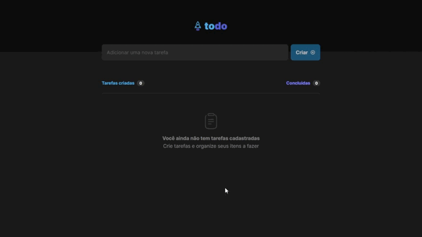

 

  <h3 align="center">Luiz Felipe - ToDo List :bookmark_tabs: </h3>
   

    <a href="https://to-do-list-rosy-theta.vercel.app/" target="_blank" >Live</a>
  

 

> :mag_right: O ToDo List é uma ferramenta para o gerenciamento de tarefas diárias. Ela serve para você que quer organizar o seu trabalho e ter mais controle do seu tempo diário.
## :computer: Funcionalidades

- Adicionar uma nova tarefa
- Marcar e desmarcar uma tarefa como concluída
- Mostrar o progresso de conclusão das tarefas
- Remover uma tarefa da listagem

## :rocket: Tecnologias

- [Vite](https://vitejs.dev/)
- [React](https://pt-br.reactjs.org/)
- [TypeScript](https://www.typescriptlang.org/)
- [RadixUI](https://www.radix-ui.com/)
- [Figma](https://www.figma.com/)
